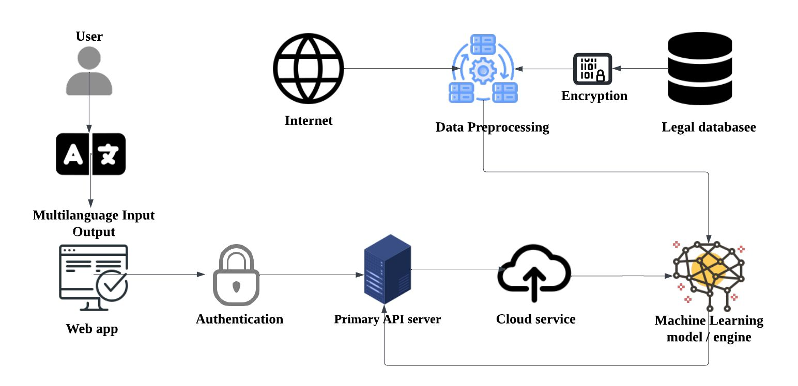
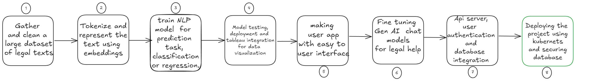

# Judgment Insight: AI-Driven Research Engine for Commercial Courts

## Overview

**Judgment Insight** is a comprehensive AI-powered research engine designed to assist commercial courts by streamlining legal research, providing predictive analytics, and promoting law literacy. Our platform integrates cutting-edge machine learning models, efficient data management, and user-friendly interfaces to deliver insightful and localized legal information.

## Features

- **Comprehensive Legal Data Aggregation**: We collect and normalize legal data from national/state databases, commercial court records, and legal literature through web scraping, APIs, and OCR.

- **AI-Driven Legal Research and Predictive Analytics**: Using pre-trained transformer models such as BERT and GPT-4, the platform mines legal texts to predict case outcomes and estimate case durations.

- **Visual Analytics and Real-Time Insights**: An interactive dashboard allows users to explore case trends, predictive insights, and visual analytics through charts and graphs.

- **Dynamic Law Repositories**: A centralized repository of dynamic national and state-level commercial laws to assist with up-to-date legal knowledge.

- **Platform for Law Literacy**: A chatbot interface to help users with legal queries based on trained AI models.

## System design



## Checkpoints



## Technologies Used

### Frontend
- **Next.js**: Server-side rendering and static site generation framework for fast, SEO-friendly web applications.
- **NextAuth**: Authentication provider to manage secure user authentication and session handling.

### Backend
- **Express.js**: Node.js framework for building APIs and routing requests to various services.
- **Flask**: Lightweight Python framework for handling API requests and running ML models.
- **PyTorch**: Machine learning library used for developing AI-driven legal research and predictive analytics models.

### Database
- **Prisma**: ORM for efficient and type-safe interaction with the PostgreSQL database.
- **PostgreSQL**: Scalable and reliable database system for managing legal data.

### Machine Learning
- **Transformers (BERT, GPT-4)**: Pre-trained NLP models for text mining and legal analysis.
- **Tableau**: Data visualization tool used to create interactive dashboards for legal analytics.

### Data Encryption
- **AES (Advanced Encryption Standard)**: Applied for securing sensitive legal data stored in the database and during transmission between services.

## Setup Instructions

### Prerequisites
- Node.js >= 14
- Python >= 3.8
- PostgreSQL
- Docker

### Installation

1. Clone the repository:
   ```bash
   git clone https://github.com/your-repo/judgment-insight.git
   cd judgment-insight
   ```

2. Install dependencies:

   - For the frontend and backend (Next.js, Express):
     ```bash
     npm install
     ```

   - For the Flask API:
     ```bash
     pip install -r requirements.txt
     ```

3. Setup the database:
   - Configure your PostgreSQL database and update the `.env` file with the correct database URL.
   - Apply Prisma migrations:
     ```bash
     npx prisma migrate deploy
     ```

4. Run the development environment:
   - Start the Next.js frontend:
     ```bash
     npm run dev
     ```
   - Start the Flask backend:
     ```bash
     flask run
     ```

### Usage

Once the development environment is running, access the platform at [http://localhost:3000](http://localhost:3000). You will be prompted to log in using NextAuth.

### Authentication

Authentication is handled using NextAuth for secure user management. Users can sign in via their preferred authentication providers.

### Machine Learning Models

Legal documents are analyzed through Flask-based APIs powered by PyTorch models. The models predict case outcomes, estimate durations, and provide insights into legal data.

### Data Security

Sensitive legal data is encrypted using AES both in transit and at rest, ensuring compliance with data privacy regulations.


